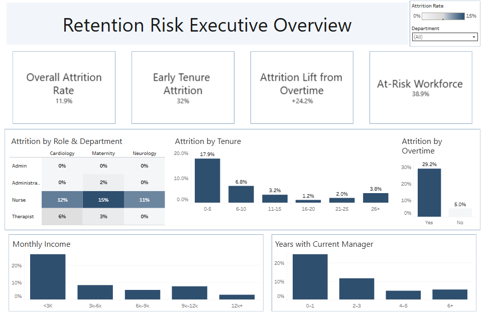

# Employee Attrition Risk Analysis

Healthcare workforce attrition analysis using SQL, Excel, and Tableau to identify retention risk drivers and recommend data-driven retention strategies.

## Project Overview

This project analyzes workforce data from a healthcare organization to identify the key drivers of employee attrition.

Key factors examined include:

- employee tenure
- overtime workload
- compensation levels
- department and role
- manager tenure

The goal of the analysis is to determine which factors contribute most strongly to employee turnover and identify opportunities to improve retention.

## Key Findings

- 11.9% overall employee attrition rate
- 32% attrition among early-tenure employees
- 29.2% attrition for employees working overtime vs 5.0% without overtime
- Nursing roles showed the highest turnover across clinical departments
- Lower salary bands experienced the highest attrition rates

## Business Recommendations

• Reduce excessive overtime through improved staffing balance  
• Strengthen onboarding and mentorship programs for early-career employees  
• Review compensation structures within lower salary bands  
• Improve staffing support for high-turnover nursing roles  
• Provide leadership training for managers early in their tenure

## Dashboard

Interactive Tableau Dashboard:
https://public.tableau.com/views/RentionRiskExecutiveOverview-Milestone4Project/Dashboard1?:language=en-US&:sid=&:redirect=auth&:display_count=n&:origin=viz_share_link

<noscript></noscript><object class='tableauViz'  style='display:none;'><param name='host_url' value='https%3A%2F%2Fpublic.tableau.com%2F' /> <param name='embed_code_version' value='3' /> <param name='site_root' value='' /><param name='name' value='RentionRiskExecutiveOverview-Milestone4Project&#47;Dashboard1' /><param name='tabs' value='no' /><param name='toolbar' value='yes' /><param name='static_image' value='https:&#47;&#47;public.tableau.com&#47;static&#47;images&#47;Re&#47;RentionRiskExecutiveOverview-Milestone4Project&#47;Dashboard1&#47;1.png' /> <param name='animate_transition' value='yes' /><param name='display_static_image' value='yes' /><param name='display_spinner' value='yes' /><param name='display_overlay' value='yes' /><param name='display_count' value='yes' /><param name='language' value='en-US' /></object>
                

## Tools Used

- SQL
- Excel
- Tableau
- Gamma
